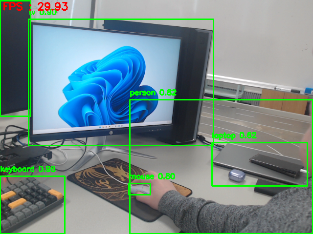
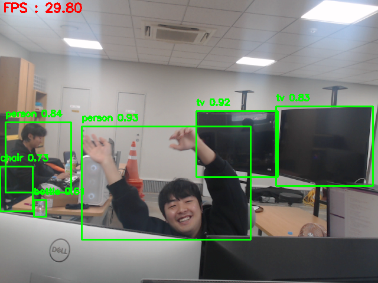
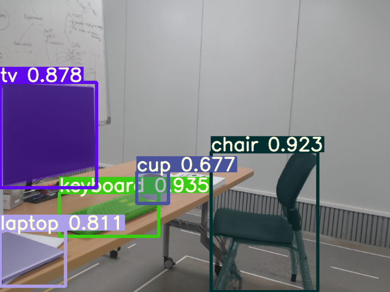
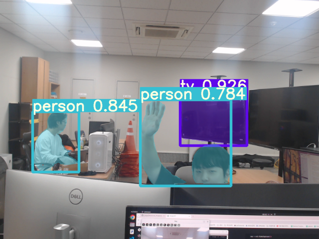

## Donwload links
- **Bounding Box**

	[YOLOv8n pretrained Model](https://github.com/ultralytics/assets/releases/download/v8.1.0/yolov8n.pt)

	[YOLOv8s pretrained Model](https://github.com/ultralytics/assets/releases/download/v8.1.0/yolov8s.pt)

	[YOLOv8m pretrained Model](https://github.com/ultralytics/assets/releases/download/v8.1.0/yolov8m.pt)

	[YOLOv8l pretrained Model](https://github.com/ultralytics/assets/releases/download/v8.1.0/yolov8l.pt)

	[YOLOv8x pretrained Model](https://github.com/ultralytics/assets/releases/download/v8.1.0/yolov8x.pt)

- **Segmentation**
	
	[YOLOv8n-seg pretrained model](https://github.com/ultralytics/assets/releases/download/v8.1.0/yolov8n-seg.pt)

	[YOLOv8s-seg pretrained model](https://github.com/ultralytics/assets/releases/download/v8.1.0/yolov8s-seg.pt)

	[YOLOv8m-seg pretrained model](https://github.com/ultralytics/assets/releases/download/v8.1.0/yolov8m-seg.pt)

	[YOLOv8l-seg pretrained model](https://github.com/ultralytics/assets/releases/download/v8.1.0/yolov8l-seg.pt)

	[YOLOv8x-seg pretrained model](https://github.com/ultralytics/assets/releases/download/v8.1.0/yolov8x-seg.pt)

The downloaded pretrained models move to pretrained folder:

`sudo mv ~/Download/*.pt ~/Personal_Project/Camera_Object_Detection/YOLOv8/pretrained/`


## Settings
Build Environments for Using YOLOv8 :
```bash
cav (#conda activate vision)
pip install opencv-python numpy matplotlib
pip install -U ultralytics
```
* if you don't have the default settings for conda, vision, then see this [README.md](../README.md) first.


## Reference
[YOLOv8 document1](https://docs.ultralytics.com/ko/modes/predict/)

[YOLOv8 document2](https://docs.ultralytics.com/ko/reference/engine/results/#ultralytics.engine.results.Results)


## Model Test
| <center>Model</center> | <center>Resolution</center> | <center>CPU</center> | <center>GPU</center> | <center>Processing Time</center> | <center>FPS</center> |

|:--------|:--------|:--------|:--------|:--------|:--------|
| <center>YOLOv8n.pt</center> | <center>640 * 480</center> | <center>i5-13600KF</center> | <center>NVIDIA GeForce RTX 4070 12GB</center> | <center>**314.75**</center> | <center>**34.00**</center> |
| <center>YOLOv8s.pt</center> | <center>640 * 480</center> | <center>i5-13600KF</center> | <center>NVIDIA GeForce RTX 4070 12GB</center> | <center>**234.39**</center> | <center>**33.51**</center> |
| <center>YOLOv8m.pt</center> | <center>640 * 480</center> | <center>i5-13600KF</center> | <center>NVIDIA GeForce RTX 4070 12GB</center> | <center>**134.21**</center> | <center>**32.42**</center> |
| <center>YOLOv8l.pt</center> | <center>640 * 480</center> | <center>i5-13600KF</center> | <center>NVIDIA GeForce RTX 4070 12GB</center> | <center>**92.48**</center> | <center>**32.36**</center> |
| <center>YOLOv8x.pt</center> | <center>640 * 480</center> | <center>i5-13600KF</center> | <center>NVIDIA GeForce RTX 4070 12GB</center> | <center>**59.22**</center> | <center>**32.34**</center> |


## Progress
1. Code to check for basic detection :

	```bash
	cav && cd Personal_Project/Camera_Object_Detection/YOLOv8
	python basic_detection.py
	```
	## [Visualization]
	
	

2. Code to check for basic segmentation :

	```bash
	cav && cd Personal_Project/Camera_Object_Detection/YOLOv8
	python basic_detection_seg.py
	```
	## [Visualization]
	
	