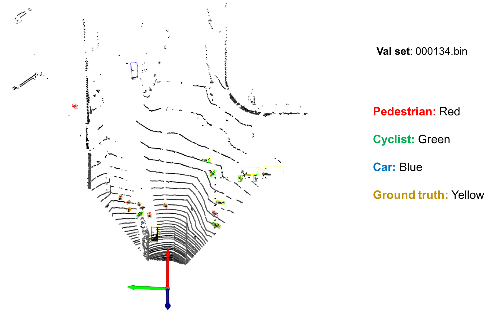
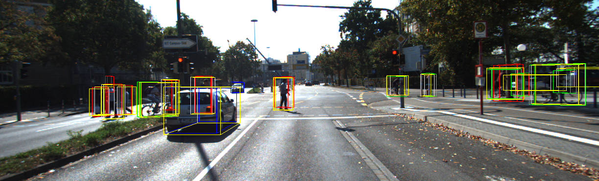

# [PointPillars: Fast Encoders for Object Detection from Point Clouds](https://arxiv.org/abs/1812.05784) 

A Simple PointPillars PyTorch Implenmentation for 3D Lidar(KITTI) Detection. [[Zhihu](https://zhuanlan.zhihu.com/p/521277176)]

## Detection Visualization




## [Datasets]

1. Download

    Download [point cloud](https://s3.eu-central-1.amazonaws.com/avg-kitti/data_object_velodyne.zip)(29GB), [images](https://s3.eu-central-1.amazonaws.com/avg-kitti/data_object_image_2.zip)(12 GB), [calibration files](https://s3.eu-central-1.amazonaws.com/avg-kitti/data_object_calib.zip)(16 MB)和[labels](https://s3.eu-central-1.amazonaws.com/avg-kitti/data_object_label_2.zip)(5 MB)。
    
    Then, make format the datasets as follows:
    ```
    dataset
        |- kitti
            |- training
                |- calib (#7481 .txt)
                |- image_2 (#7481 .png)
                |- label_2 (#7481 .txt)
                |- velodyne (#7481 .bin)
            |- testing
                |- calib (#7518 .txt)
                |- image_2 (#7518 .png)
                |- velodyne (#7418 .bin)
    ```

2. Make dataset
    ```bash
    cd ~/Download
    unzip data_object_velodyne.zip
    unzip data_object_image_2.zip
    unzip data_object_calib.zip
    unzip data_object_label_2.zip

    mkdir -p ~/dataset/kitti/training && mkdir -p ~/dataset/kitti/testing
    sudo mv -r ~/Download/data_object_velodyne/training/velodyne ~/dataset/kitti/training/
    sudo mv -r ~/Download/data_object_velodyne/testing/velodyne ~/dataset/kitti/testing/
    sudo mv -r ~/Download/data_object_image_2/training/image_2 ~/dataset/kitti/training/
    sudo mv -r ~/Download/data_object_image_2/testing/image_2 ~/dataset/kitti/testing/
    sudo mv -r ~/Download/data_object_calib/training/calib ~/dataset/kitti/training/
    sudo mv -r ~/Download/data_object_calib/testing/calib ~/dataset/kitti/testing/
    sudo mv -r ~/Download/data_object_label_2/training/label_2 ~/dataset/kitti/training/
    ```
    Now which in Download folder becomes dummy. So delete as follows:
    ```bash
    sudo rm -rf ~/Download/data_object_velodyne
    sudo rm -rf ~/Download/data_object_image_2
    sudo rm -rf ~/Download/data_object_calib
    sudo rm -rf ~/Download/data_object_label_2
    ```

3. Pre-process KITTI datasets first
    ```bash
    cd ~/Personal_Project/LiDAR_Object_Detection/PointPillars/ && cal
    python pre_process_kitti.py
    ```

    Now, we have datasets as follows:
    ```
    dataset
        |- kitti
            |- training
                |- calib (#7481 .txt)
                |- image_2 (#7481 .png)
                |- label_2 (#7481 .txt)
                |- velodyne (#7481 .bin)
                |- velodyne_reduced (#7481 .bin)
            |- testing
                |- calib (#7518 .txt)
                |- image_2 (#7518 .png)
                |- velodyne (#7518 .bin)
                |- velodyne_reduced (#7518 .bin)
            |- kitti_gt_database (# 19700 .bin)
            |- kitti_infos_train.pkl
            |- kitti_infos_val.pkl
            |- kitti_infos_trainval.pkl
            |- kitti_infos_test.pkl
            |- kitti_dbinfos_train.pkl
    ```

## [Compile]

```bash
cd ops && cal
pip install numba numpy open3d opencv-python pyyaml tqdm setuptools
python setup.py develop
```
* if you don't have the default settings for conda, lidar, then see this [README.md](../README.md) first.

## [Training]

```bash
cd ~/Personal_Project/LiDAR_Object_Detection/PointPillars/ && cal
python train.py
```

## [Evaluation]

```bash
cd ~/Personal_Project/LiDAR_Object_Detection/PointPillars/ && cal
python evaluate.py
```

## [Test]

```bash
cd ~/Personal_Project/LiDAR_Object_Detection/PointPillars/ && cal

# 1. infer and visualize point cloud detection
python test.py --pc_path your_pc_path 


# 2. infer and visualize point cloud detection and gound truth
python test.py --pc_path your_pc_path --calib_path your_calib_path  --gt_path your_gt_path


# 3. infer and visualize point cloud & image detection
python test.py --pc_path your_pc_path --calib_path your_calib_path --img_path your_img_path
```

* e.g. [infer on val set 000040]
```bash
# 1. infer and visualize point cloud detection
python test.py --pc_path ~/dataset/kitti/testing/velodyne_reduced/000040.bin


# 2. infer and visualizae point cloud detection & image detection & ground truth
python test.py --pc_path ~/dataset/kitti/testing/velodyne_reduced/000040.bin --calib_path ~/dataset/kitti/testing/calib/000040.txt --img_path ~/dataset/kitti/testing/image_2/000040.png --gt_path ~/dataset/kitti/testing/label_2/000040.txt
```

## [Test Detection Visualization]


